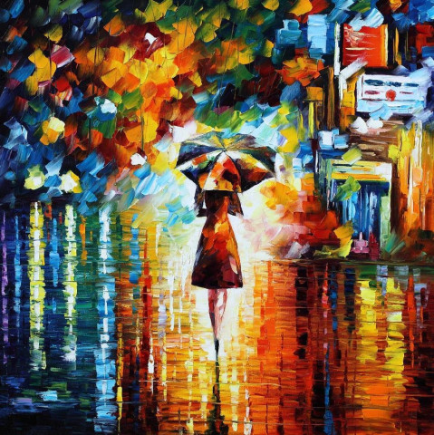

# neural-style 

Neural style in tensorflow! This is a tensorflow implementation based on the ideas from this [paper][paper]. Using a neural net we can differentiate style from content and combine two images.

## Examples


These were the input images used :



[Rain Princess - Leonid Afremov][rain]


## Prerequisite
Get Pre-trained VGG network:
```wget http://www.vlfeat.org/matconvnet/models/beta16/imagenet-vgg-verydeep-19.mat```


## Reference
[A Neural Algorithm of Artistic Style (Leon A. Gatys, et al.)][paper]

[paper]: http://arxiv.org/abs/1508.06576
[rain]: https://afremov.com/RAIN-PRINCESS-Palette-knife-Oil-Painting-on-Canvas-by-Leonid-Afremov-Size-30-x30.html